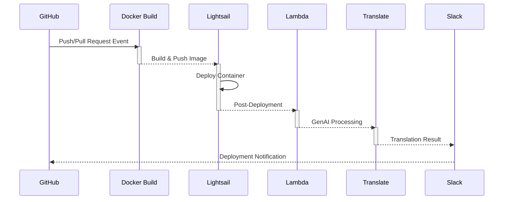
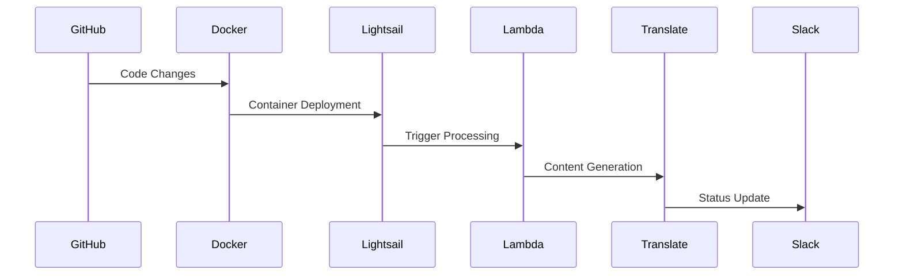
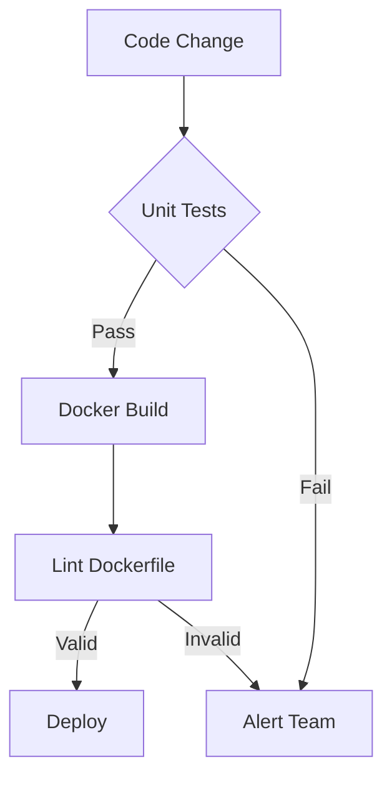
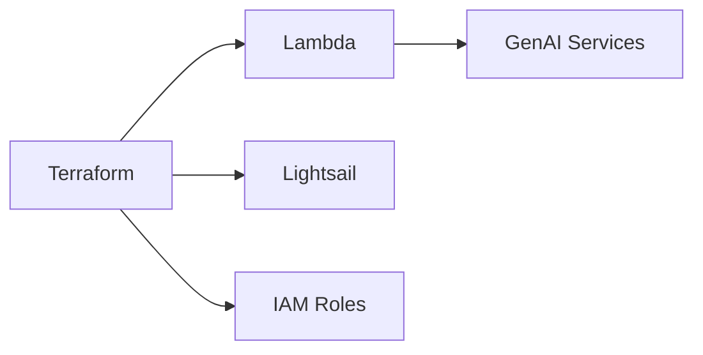

# Magento-2-e-commerce-application
cicd-demo-magento2


Here's a comprehensive update with both the diagram and README.md contents:

**Diagram (Embed in README.md using Mermaid)**
````markdown

````

**Updated README.md**
```markdown
# AWS Lightsail Deployment Pipeline


## Pipeline Overview
This CI/CD pipeline automates the deployment process to AWS Lightsail with integrated AI processing:



## Deployment Process
1. **Trigger**: On push/pull request to `main` branch
2. **Build Phase**:
   - Docker image build with commit SHA tag
   - Image validation using Hadolint linter
   - Unit tests execution
3. **Deployment Phase**:
   - Push container to AWS Lightsail
   - Update production/staging environment
   - Automatic Lambda invocation for GenAI processing
4. **Post-Deployment**:
   - Content translation example (EN → FR)
   - Slack notification to team channel

## Testing & Validation


### Key Testing Steps
1. **Unit Tests**:
   ```bash
   php bin/magento dev:tests:run unit
   ```
2. **Dockerfile Linting**:
   ```bash
   hadolint docker/Dockerfile
   ```
3. **AI Translation** (Example):
   ```bash
   aws translate translate-text --text "Welcome" --source en --target fr
   ```

## Infrastructure Setup


### Prerequisites
- AWS Account with Lightsail/Lambda access
- GitHub Secrets configured:
  - `AWS_ACCESS_KEY_ID`
  - `AWS_SECRET_ACCESS_KEY`
  - `LAMBDA_NAME`
- Terraform 1.5+ installed

## Getting Started
1. Clone repository
2. Initialize Terraform:
   ```bash
   terraform init
   terraform apply -var="lambda_name=YOUR_FUNCTION" -var="lightsail_instance_name=magento2-prod"
   ```
3. Configure GitHub Secrets via Repository Settings
4. Push to `main` branch to trigger deployment

## Customization
- Modify `payload.json` for Lambda input requirements
- Update translation parameters in `.github/workflows/deploy.yml`
- Adjust Lightsail container specs in Terraform
```

This documentation update:
1. Provides visual workflow representation
2. Explains each pipeline stage clearly
3. Includes infrastructure diagrams
4. Gives executable code examples
5. Shows relationships between components
6. Provides setup/configuration instructions

The mermaid diagrams will render automatically in GitHub Markdown viewers. For full visualization, consider adding actual workflow diagram images (placeholder used in example).
